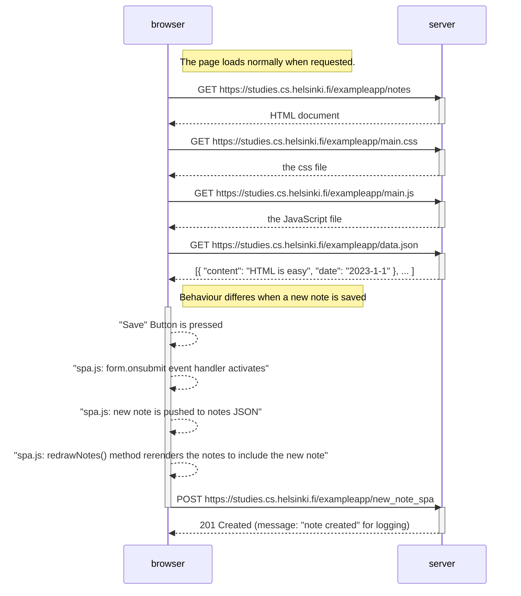

```mermaid
sequenceDiagram

    participant browser
    participant server
    
    Note right of browser: The page loads normally when requested.

    browser->>server: GET https://studies.cs.helsinki.fi/exampleapp/notes
    activate server
    server-->>browser: HTML document
    deactivate server

    browser->>server: GET https://studies.cs.helsinki.fi/exampleapp/main.css
    activate server
    server-->>browser: the css file
    deactivate server

    browser->>server: GET https://studies.cs.helsinki.fi/exampleapp/main.js
    activate server
    server-->>browser: the JavaScript file
    deactivate server

    browser->>server: GET https://studies.cs.helsinki.fi/exampleapp/data.json
    activate server
    server-->>browser: [{ "content": "HTML is easy", "date": "2023-1-1" }, ... ]
    deactivate server

    Note right of browser: Behaviour differes when a new note is saved

    activate browser
    browser-->>browser: "Save" Button is pressed
    browser-->>browser: "spa.js: form.onsubmit event handler activates"
    browser-->>browser: "spa.js: new note is pushed to notes JSON"
    browser-->>browser: "spa.js: redrawNotes() method rerenders the notes to include the new note"
    browser->>server: POST https://studies.cs.helsinki.fi/exampleapp/new_note_spa
    deactivate browser

    activate server
    server-->>browser: 201 Created (message: "note created" for logging)
    deactivate server
```
