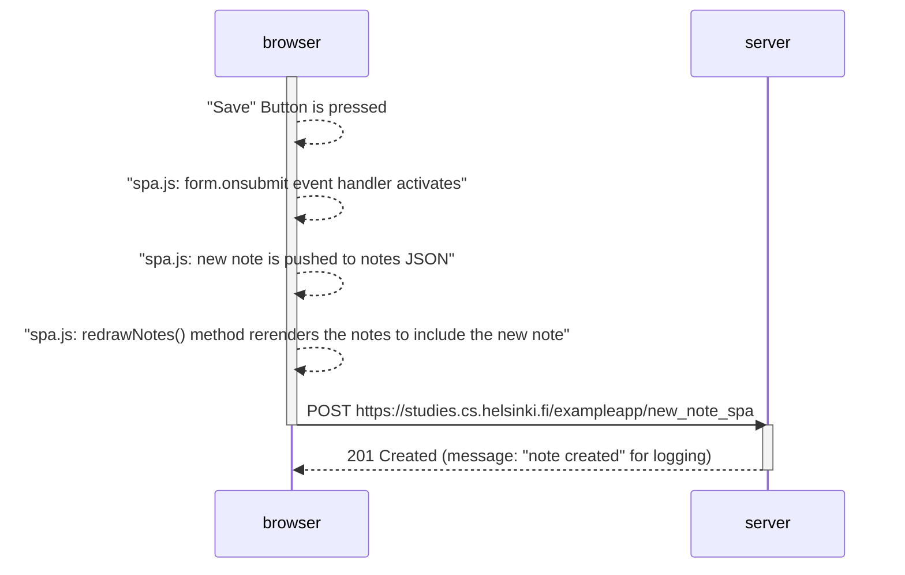

```mermaid
sequenceDiagram
participant browser
participant server

    activate browser
    browser-->>browser: "Save" Button is pressed
    browser-->>browser: "spa.js: form.onsubmit event handler activates"
    browser-->>browser: "spa.js: new note is pushed to notes JSON"
    browser-->>browser: "spa.js: redrawNotes() method rerenders the notes to include the new note"
    browser->>server: POST https://studies.cs.helsinki.fi/exampleapp/new_note_spa
    deactivate browser

    activate server
    server-->>browser: 201 Created (message: "note created" for logging)
    deactivate server
```
